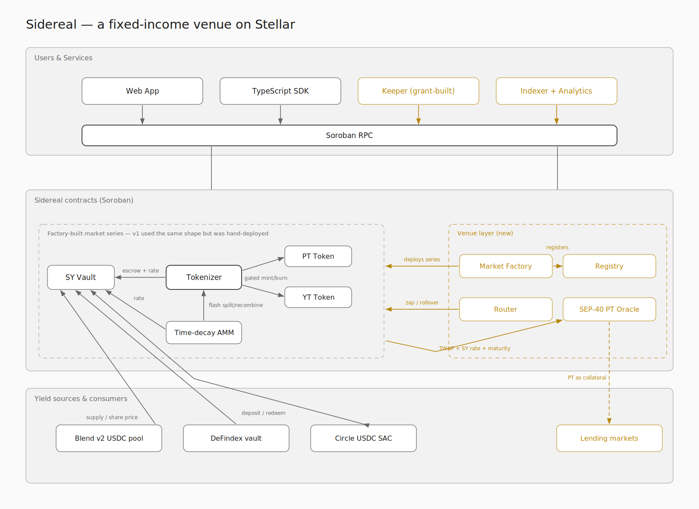
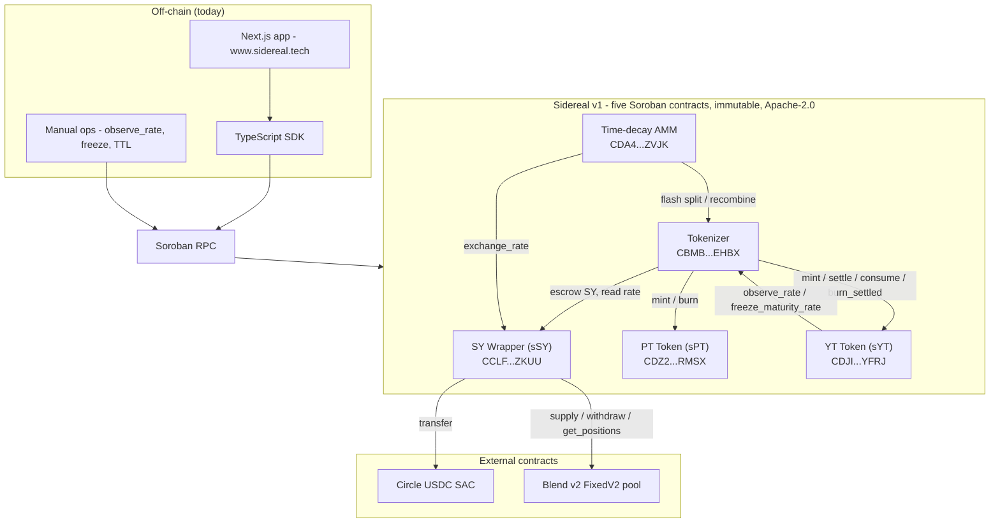
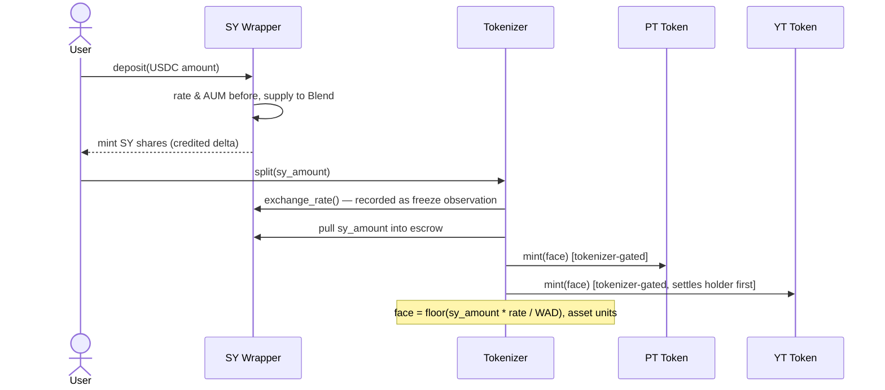
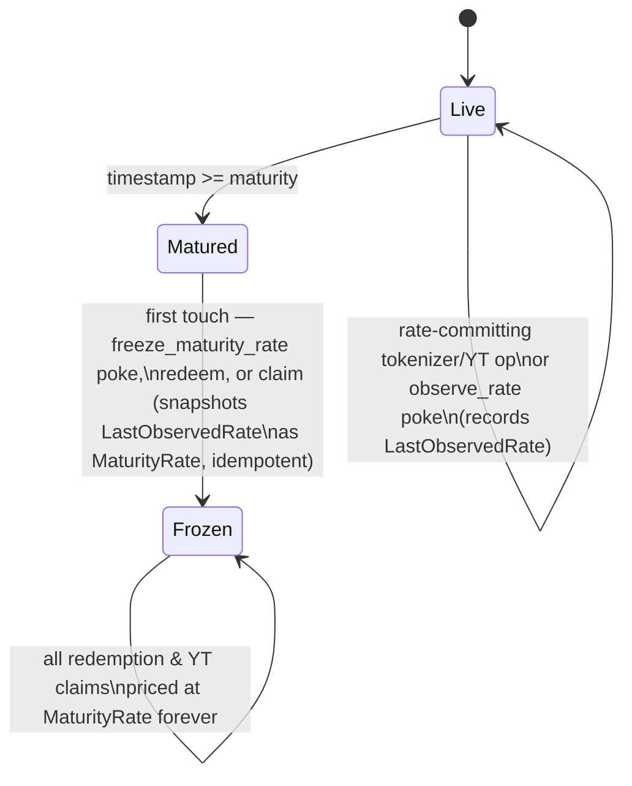
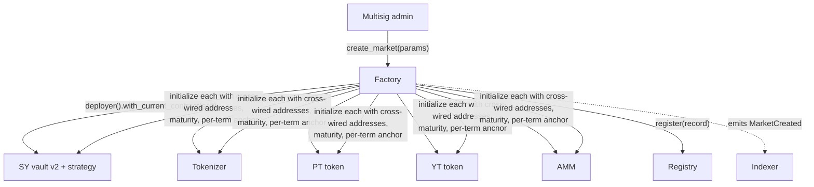
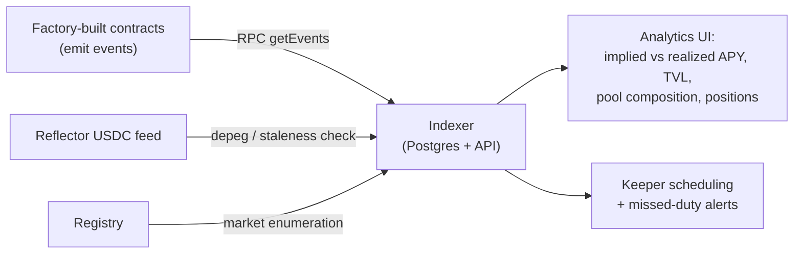

# Sidereal — Technical Architecture (SCF #45 submission)



_Figure: full-system target topology. Gray elements are v1 or external
foundations; amber elements are contracts and services._

---

## Part I — The system

### 1. System context



Dependencies flow downward only: the SY wrapper knows nothing of the tokenizer,
the tokenizer nothing of the AMM. The one deliberate upward edge is YT →
tokenizer, and it exists for maturity-freeze consistency (§4.4).

**Decision: five separate contracts, not one.** Each layer has a distinct trust
surface: SY custodies external positions, the tokenizer custodies escrow, the
tokens hold balances, the AMM holds pool reserves. Separate contracts make each
surface independently auditable and let the tokens gate their privileged
entrypoints on exactly one caller (the tokenizer's address, fixed at init).

**Decision: immutable contracts.** No contract has an upgrade entrypoint, a
`set_admin`, a pause, or a fee setter (verified across all five sources; the
admin-surface audit is recorded in `docs/deploy/MAINNET_PARAMETERS.md:94-101`).
The single live admin lever is `migrate_reserve_index` (§2.4). This buys
depositors a fixed trust surface at the cost of redeploy-to-fix; the curated
30-day market keeps that cost bounded.

### 2. Layer 1 — SY wrapper (`contracts/sy-wrapper`)

The SY wrapper is an ERC-4626-style share vault implemented natively for
Soroban (the design is comparable to OpenZeppelin's Stellar Vault extension,
but this is an independent implementation — there is no OZ dependency in
`Cargo.lock`). It custodies USDC in a Blend v2 **plain supply** position and
issues transferable SEP-41 shares (`sSY`, 7 decimals to match USDC).

**2.1 Exchange rate is derived, never set.** Under Blend custody the rate is

```
exchange_rate = assets_under_management * WAD / total_sy_supply     (WAD = 1e18)
aum           = b_tokens * b_rate / SCALAR_12                       (Blend's own floor math)
```

(`sy-wrapper/src/lib.rs:613-633`, `blend-adapter/src/lib.rs:129-145`). The
admin rate-setter `set_exchange_rate` returns `ReadOnlyExchangeRate` whenever a
pool is configured (`sy-wrapper/src/lib.rs:149-151`), and the deploy pipeline
refuses to record a non-Blend mainnet wrapper. **Why:** an admin-settable rate
was the root cause of the internal `#9 Insolvent` incident — a rate that can be
lowered arbitrarily can misprice every layer above it. A rate derived from the
pool's own `b_rate` moves only with accrued interest.

**2.2 Deposits mint on the credited delta, not the requested amount.** Deposit
reads the exchange rate and the Blend AUM _before_ the assets enter, supplies
to Blend, then mints shares against the _measured AUM increase_
(`sy-wrapper/src/lib.rs:504-522`). Blend's bToken mint floors in the pool's
favor, so crediting the requested amount would mint SY the position doesn't
back and tick the rate down for everyone else. **What would break otherwise:**
repeated dust deposits would become a slow rate-deflation attack on holders.

**2.3 Withdrawals fail closed and burn only what was delivered.** Redeem uses
Blend's `try_submit` so a pool failure surfaces as a typed
`BlendWithdrawalFailed` _before_ any share is burned; if Blend delivers less
than requested (liquidity cap), the wrapper burns proportionally fewer shares
(`sy-wrapper/src/lib.rs:561-587`). A failed withdraw can never consume SY.

**2.4 The reserve-index trap and its one admin lever.** The wrapper records the
underlying's Blend reserve index at init, cross-checked three ways (position in
`get_reserve_list`, the pool's own `get_reserve(...).config.index`, and
`decimals == 7`; `sy-wrapper/src/lib.rs:112-124`). Every AUM read re-verifies
the index and traps `InvalidBlendReserve` if the pool has reindexed
(`sy-wrapper/src/lib.rs:719-727`) — pricing the wrong reserve would be worse
than halting. Because that trap alone would brick the market permanently,
`migrate_reserve_index` exists: it re-derives the index with the same
three-way check, so the strongest thing the admin can do is re-point the
wrapper at _the same USDC_ under its new slot — never a different asset
(`sy-wrapper/src/lib.rs:162-224`). This is the only post-deploy admin function
in the entire system, and it emits the system's only v1 event
(`ReserveMigrated`).

**2.5 Plain supply, never collateral.** The adapter uses Blend request type
`Supply` (0), not `SupplyCollateral` (`blend-adapter/src/lib.rs:102-106`). The
wrapper never borrows, so its position can never be seized in a liquidation —
custody risk reduces to Blend solvency itself.

**2.6 Per-holder principal tracking.** The wrapper tracks each holder's
deposited principal and moves it pro-rata on transfer (rounded down, sender
keeps the dust) so `accrued_yield(holder) = shares*rate − principal` stays
correct for both parties (`sy-wrapper/src/lib.rs:402-426`). Display-only; no
economic path reads it.

### 3. Layer 2 — Tokenizer (`contracts/tokenizer`)



**3.1 PT and YT are denominated in asset units, not shares.** `split` mints
`face = floor(sy_amount · rate / WAD)` of each (`tokenizer/src/lib.rs:223-247`).
**Why:** this is what makes PT fungible across holders who split at different
rates — 1 PT is always a claim on 1 unit of USDC at maturity. Share-denominated
PT (the early prototype) silently handed YT's yield to PT.

**3.2 Solvency is priced, not gated.** No entrypoint asserts escrow coverage.
Redemption and recombine cap the payout at the holder's pro-rata share of
escrow (`min(floor(pt·WAD/rate), floor(escrow·pt/pt_supply))`,
`tokenizer/src/lib.rs:274-289,324-331`); YT claims pay only from the surplus
above a _ceil-rounded_ PT face reservation (§3.3). **Why:** with a real Blend
rate the escrow has zero slack at mint, and Blend's floor rounding can tick the
rate down by a sub-stroop notch; an on-chain `Insolvent` gate turned that dust
into a frozen market (every claim reverting). Pendle makes the same call:
shortfalls become haircuts, not halts. The retired error code 9 stays reserved
(`tokenizer/src/lib.rs:65-67`).

**3.3 PT is senior; YT yield is junior — enforced in the claim path.**
`claim_yield` settles the holder (banking their owed yield _without_ zeroing
it), computes `surplus = max(0, escrow − ceil(pt_supply·WAD/rate))`, pays
`min(owed, surplus)`, and `consume`s exactly what it paid
(`tokenizer/src/lib.rs:360-407`). The reservation rounds **up** so PT can never
be shorted by a rounding notch. Whatever the surplus cannot cover stays banked
in the YT ledger — never overpaid, never lost. The `settle`/`consume` split on
the YT contract exists precisely because an all-or-nothing settle could not
express a partial, surplus-capped payment (`yt-token/src/lib.rs:146-194`).

**3.4 The maturity-rate state machine.** Blend has no maturity concept — it
keeps accruing after our market expires. If redemption read a live
post-maturity rate, the _timing_ of the first post-maturity transaction would
move value between PT and YT. The tokenizer therefore freezes the **last rate
observed at or before maturity**, never a live post-maturity read:



Every rate-committing tokenizer path, and every direct YT holder path via
`committing_rate` (§4.3), records an observation as a side effect (plain AMM
swaps do not — they never touch the tokenizer);
`observe_rate` is a **permissionless** poke so a keeper (or a YT holder who
wants credit up to the wire) can refresh an idle market
(`tokenizer/src/lib.rs:124-129,541-583`). The unobserved tail between the last
observation and the maturity instant deterministically favors PT — consistent
with PT seniority, and narrowable to nothing by poking. This design is what
makes keeper automation (Part II §10) a _liveness_ optimization, not a trust
requirement.

**3.5 256-bit intermediate math.** All tokenizer mul-divs route through `I256`
(`tokenizer/src/lib.rs:473-496`) because `pt_supply · WAD` can exceed i128 even
when the quotient fits — an audit-found spurious-revert class. The AMM keeps
i128 checked math instead, under explicit reserve caps (§4.6).

### 4. PT and YT tokens (`contracts/pt-token`, `contracts/yt-token`)

Both are SEP-41 tokens (7 decimals, `sPT` / `sYT`) whose `mint` is gated on the
tokenizer address fixed at init (`require_auth` on the tokenizer —
`yt-token/src/lib.rs:202-224`). PT is otherwise a plain token: it deliberately
has **no** redemption-quote helper, because only the tokenizer holds the frozen
rate and escrow balance needed to quote one (`pt-token/src/lib.rs:106-110`).

**4.1 YT's yield engine: checkpoint + banked ledger.** Each holder carries a
`Checkpoint` (the rate they last settled at) and `AccruedYield` (banked SY
shares), both persistent, holder-keyed entries. Settling from checkpoint `c` to
rate `r` banks

```
owed = balance * (r − c) / c   * WAD / r      (SY shares, floor at each step)
     = balance * (1/c − 1/r) * WAD
```

(`yt-token/src/lib.rs:465-485`). **Why this form:** it telescopes
algebraically — settling at every transfer sums to one settle at the end, up
to per-step floor rounding whose dust always favors the escrow — so no
transfer pattern can overclaim yield (frequent settlement can only underclaim
by rounding dust, never the reverse). A naive `(r − c)` overpays whenever `c > 1`.
Checkpoints never move backward on a rate dip (`settle_into_ledger` holds them,
`yt-token/src/lib.rs:438-463`), so a regressed rate pays nothing until it
recovers past the holder's checkpoint.

**4.2 Every YT balance change settles both parties first.** Mint, transfer,
transfer_from, burn, burn_from all settle before moving balances, so a seller
keeps yield earned while holding and a buyer accrues only from the transfer
forward.

**4.3 The rate-sourcing discipline (re-entrancy-shaped design).** Soroban
prohibits re-entering a contract already on the call stack. That constraint
shapes who fetches the rate:

- Paths **through the tokenizer** (`split→mint`, `claim→settle/consume`,
  `recombine→burn_settled`): the tokenizer observes one canonical rate and
  **hands it down** as an argument. YT trusts it because those entrypoints are
  gated on the tokenizer's own auth (`yt-token/src/lib.rs:157-165`).
- Paths that enter YT **directly** (holder transfer/burn): YT calls **into the
  tokenizer** — `observe_rate` before maturity, `freeze_maturity_rate` after
  (`committing_rate`, `yt-token/src/lib.rs:353-387`). Never a raw SY read.

**Why the second rule matters:** without it, a direct YT transfer could bank
yield at a rate the freeze never saw; the first post-maturity touch could then
freeze an older, lower rate — YT's ledger would hold yield the escrow
accounting never recognized. Routing every committed rate through the tokenizer
makes "the freeze saw every rate anyone settled at" an invariant.

**4.4 Standalone YT burn may drop YT supply below PT supply — by design.** No
economic path reads YT total supply (escrow coverage, the PT-senior cap, and
pro-rata all read `pt_total_supply` only); the burner forfeits their own future
yield to escrow, favoring the senior side (`yt-token/src/lib.rs:293-311`,
`findings.md` M5).

### 5. Layer 3 — Time-decay AMM (`contracts/amm`)

One pool holds PT and SY and prices all three assets; YT trades through the
same pool via flash composition (§6). The curve is Pendle-style (Pendle V2
adapted Notional's), reimplemented in integer fixed-point with the v1 unit
deviation below.

**5.1 The curve as implemented — including a known unit deviation.** With
reserves `total_pt` (face units) and `total_sy` (shares), proportion
`p = (total_pt − net_pt) / (total_pt + total_sy)`:

```
rate_scalar(τ)   = scalar_root · YEAR / τ                       (amm/src/lib.rs:1149)
exchange_rate    = ln(p/(1−p)) / rate_scalar + rate_anchor      (amm/src/lib.rs:1216-1242)
ln_implied_rate  = ln(exchange_rate) · YEAR / τ                 (amm/src/lib.rs:1183-1200)
implied APY bps  = ln_implied_rate · 10⁴ / WAD                  (continuously compounded)
```

`exchange_rate` is enforced ≥ 1 and the pool rejects any trade pushing `p`
above 96% (`MAX_MARKET_PROPORTION`) — the curve's log term degenerates near 1.

**Known deviation from Pendle (findings.md M6, confirmed 2026-07-18):** the
curve consumes `total_sy` as raw SY _shares_ while `total_pt` is asset-unit
face; Pendle's `MarketMathCore` values the SY reserve at the index
(`totalSy → asset`) before curve math and converts outputs back. Only the YT
flash routes perform that boundary conversion in v1; the plain PT↔SY legs do
not. So `exchange_rate` is a _face-per-share_ conversion factor; its reciprocal
is shares paid per unit of PT face. At
SY rate R > 1 the curve's maturity convergence pins PT face to one SY share
(= R assets) against a redemption value of one asset, an (R−1)-bounded LP
leak near maturity, and the quoted implied APY is share-denominated, drifting
from the true fixed rate as R accrues. The live market is short (30 days) and
small (about 5 PT + 5 SY seeded), but its exact loss cannot be bounded from the
`1.0063` initial anchor — that parameter is not the live SY rate. At an
illustrative 8% annualized SY return, 30 days of accrual is roughly 0.66%
before the single 10-bps PT-sale fee; actual impact must be measured from
on-chain rate observations. The defect scales with term and realized SY
return, so **the factory-built AMM in Part II normalizes units per Pendle and
adds non-par-rate economic tests** — a hard prerequisite for longer maturities.
The deployed v1 AMM is immutable and runs out its term with the deviation
documented.

**5.2 The anchor is re-derived every trade, not stored.** Before pricing, the
pool recomputes `rate_anchor` from the _last traded implied rate_ at the
current τ (`get_rate_anchor_or_panic`, `amm/src/lib.rs:1159-1181`):

```
rate_anchor = exp(last_ln_implied_rate · τ/YEAR) − ln(p)/rate_scalar
```

**Why:** as τ decays, a fixed anchor would make the _implied APY_ drift between
trades with no market input. Re-anchoring holds the implied rate continuous
across time decay, so only trades move it — and as `τ → 0`,
`rate_scalar → ∞` collapses the curve onto `exchange_rate = anchor → 1`. In
v1's share-space accounting (M6, §5.1) that pins PT face to one SY _share_ at
maturity, which equals asset par only at R = 1; the unit-normalized
factory-built curve converges to true asset par. `initial_anchor` seeds only the
first liquidity event; from then on the market discovers its own anchor. The
per-term seeding formula (`initial_anchor = (1+APY)^(maturity_days/365)`) is
derived in `docs/deploy/MAINNET_PARAMETERS.md:57-78` — this is what the factory
parameterizes per maturity in Part II.

**5.3 Integer transcendentals, because the wasm target rejects floats.**
Soroban's VM refuses float opcodes (CI enforces a no-float guard on every wasm
build). `ln` is computed by range-reducing `m·2^k` with `m ∈ [1,2)` and an
atanh series with `z = (m−1)/(m+1) ≤ 1/3` (24 terms, ~9× decay per term —
converges far past 1e-18); `exp` by `x = k·ln2 + r`, `|r| ≤ ln2/2`, 20-term
Taylor, with an explicit `k > 90` overflow refusal
(`amm/src/lib.rs:1293-1408`). Newton integer sqrt replaces f64 sqrt for LP
bootstrap — f64's 53-bit mantissa cannot even represent products near WAD²
(`amm/src/lib.rs:1299-1314`). This is a shipped fixed-point implementation of
a Pendle-style curve on Soroban, with the M6 unit deviation documented in
§5.1.

**5.4 Exact-out is solved by binary search over the exact-in primitive**
(`amm/src/lib.rs:875-904,1008-1041`). The search accepts a candidate only if
its cost fits the input, so a locally non-monotone cost curve can only make the
result _suboptimal for the trader_, never unsafe for the pool.

**5.5 Fees.** A single `fee_bps` (mainnet: 10 bps) applies to the SY side of
every curve trade — subtracted (floor) from SY out, added (ceil) to SY in
(`amm/src/lib.rs:836-838,966-968`). YT routes pay it on their embedded PT leg.
Fees accrete to reserves, i.e. to LPs pro-rata; there is no protocol fee switch
(and no admin who could flip one).

**5.6 Reserves reconcile to real balances.** After every transfer leg, state
reserves snap to the pool's actual token balances
(`reconcile_reserves`, `amm/src/lib.rs:682-685`). Donations and rounding dust
are absorbed into LP value rather than tracked as phantom state. Amount and
reserve caps (`MAX_RESERVE_UNITS = 1e18` base units = 100B USDC at 7 decimals)
keep every i128 intermediate far from overflow.

**5.7 LP mechanics.** First LP mints `sqrt(pt·sy)` shares with `MINIMUM_LIQUIDITY`
(1000) permanently locked (donation/ratio-manipulation guard); later LPs mint
`min(pt-ratio, sy-ratio)` and are charged the exact pro-rata amounts (rounded
up); `remove_liquidity` refuses to drain the final LP share
(`amm/src/lib.rs:492-585`). LP balances are persistent per-holder entries with
their own TTL (§12), plus permissionless `bump_lp_ttl`.

**5.8 TWAP — useful for display, not yet collateral-grade.** Every trade folds
the observed ln-implied-rate into an EWMA with weight `elapsed/window` (mainnet
window: 1800 s). After an idle gap ≥ one full window, the TWAP **snaps to the
new observation and re-enters warm-up** (`amm/src/lib.rs:1121-1147`). Two
honest limitations, both grant scope:

- **The warm-up flag expires on the clock, not on evidence.** After a snap,
  `twap_warming_up()` turns false once 30 minutes pass even if _no further
  trade occurred_ — a single trade on an idle pool can set the TWAP, and the
  attacker just waits out the flag. Collateral-grade consumption therefore
  needs freshness, minimum-observation coverage, and liquidity floors on top
  of the boolean (§11), not the boolean alone.
- **The app does not currently gate on the flag.** The trade and pool pages
  render implied APY confidently during warm-up (`findings.md` M2, demonstrated
  live on mainnet in the 2026-07-11 usage log); only the yield-choice helper
  gates. A code comment in `sync_twap` claiming "the SDK and app already do"
  is stale against M2. The analytics deliverable renders warm-up states
  honestly; the fix for the trade/pool pages is the M2 item.

Context: the Feb 2026 YieldBlox incident on Stellar was an oracle
manipulation. Native TWAP is the right substrate for the SEP-40 oracle in
Part II, but only with the §11 guards layered on.

### 6. The YT flash routes (single liquidity book)

The pool holds only PT and SY, yet quotes YT bidirectionally — YT trades are
composed _atomically through the tokenizer_ inside one transaction. This is
why one seeded pool serves all three markets, instead of fragmenting liquidity
across PT/SY, YT/SY, and PT/YT books.

**Buy YT (`swap_sy_for_yt`, `amm/src/lib.rs:397-448`):**

```mermaid
sequenceDiagram
    actor B as Buyer
    participant A as AMM pool
    participant T as Tokenizer
    participant S as SY token
    participant Y as YT token

    B->>A: swap_sy_for_yt(sy_in, min_yt_out)
    A->>S: exchange_rate() — same source tokenizer uses
    A->>A: binary-search yt_out; curve books PT-in trade
    A->>S: pull buyer's sy_in
    Note over A,T: authorize_as_current_contract:<br/>tokenizer.split(amm, shares) + sy.transfer(amm→tokenizer)
    A->>T: split(amm, ceil(yt_out·WAD/rate))
    T->>S: pull shares into escrow
    T-->>A: mint PT + YT to pool
    A->>Y: transfer yt_out to buyer
    Note over A: PT stays in pool (the curve bought it);<br/>over-minted dust pair stays pool-side
```

**Sell YT (`swap_yt_for_sy`, `amm/src/lib.rs:450-490`):** symmetric — the pool
books a PT-out trade, pulls the seller's YT, pre-authorizes
`tokenizer.recombine(amm, yt_in, yt_in)` plus the PT/YT burns it performs on
pool balances, recombines pool PT + seller YT into SY, pays the seller
`sy_value − sy_cost`, keeps the spread.

**The rounding covenant.** Shares into a split are rounded **up**
(`ceil(face·WAD/rate)`) so the tokenizer's floored mint always covers the
quoted amount; shares out of a recombine are budgeted **down**
(`floor(face·WAD/rate)`) mirroring the tokenizer's own floor. Up to one face
unit of matched PT+YT dust per buy stays in pool custody — the trader never
receives it, so rounding cannot be farmed against LPs; if the recombine
delivers less than budget the escrow is genuinely short and the swap **fails
closed** rather than paying the seller from LP funds
(`amm/src/lib.rs:426-428,478-485`). Accepted v1 posture, bounded by
integration tests (`ARCHITECTURE.md` §4.3).

**Why flash composition is safe here:** Soroban gives transaction-level
atomicity (no separate flash-loan primitive to secure) and prohibits
re-entrancy, and the pre-authorized sub-invocation list (§11) means the
tokenizer can do _exactly_ the enumerated operations on pool balances and
nothing else.

---

## Part II — What this grant builds

Numbering continues; everything below is new scope. The deliverable-to-tranche
mapping and budgets live in the SCF form; this part is the _how_.

### 7. Market factory and registry

**The trigger for an on-chain registry.** `MULTI_STRATEGY.md` (decision 5)
deliberately deferred an on-chain registry "until there is a concrete
permissionless-discovery requirement." The grant scope _is_ that requirement:
with N concurrent maturities, the SDK, the analytics indexer, the keeper, and
the PT oracle all need one authoritative, on-chain enumeration of live markets
— a reviewed-manifest flow cannot serve contracts. The manifest pipeline
(`deployments/markets/<network>/<id>.toml`) remains as the human-audited
provenance layer; the registry is its on-chain projection.

**Registry (new contract).** Stores one record per market:

```
MarketRecord {
  market_id: u32,
  sy: Address, tokenizer: Address, pt: Address, yt: Address, amm: Address,
  adapter_kind: Symbol,       // "blend" | "defindex"
  underlying: Address,
  maturity: u64,
  status: MarketStatus,       // Announced | Live | Matured | Retired
}
```

Reads are permissionless (`markets()`, `market(id)`, `live_markets()`);
writes are factory-only. Registration is append-only; `status` is the only
mutable field, and it moves monotonically forward. The v1 market is
back-registered at genesis so consumers see one uniform list.

**Factory (new contract).** Holds the uploaded wasm hashes of the five market
contracts and deploys a full series atomically:



Deployment uses Soroban's deployer with a deterministic salt
(`market_id ‖ adapter_kind ‖ maturity`), so addresses are predictable. The
target is creation and initialization in one transaction; whether six
deploys-plus-inits fit Soroban's per-transaction resource limits is an open
implementation question to be measured early in T1, and the fallback is a
two-phase deploy with an atomicity guard — the registry records a market only
after every contract of the series is initialized and cross-checked, so a
partial series can never appear live. Per-term curve parameterization applies
the anchor formula from §5.2: the factory takes a target APY and term,
computes `initial_anchor`, and rejects parameter sets outside the v1
validation bounds (the same `initialize` checks at `amm/src/lib.rs:150-170`
remain the last line of defense).

**The factory-built AMM is v2 of the curve, not a redeploy of v1's wasm.** It
carries the M6 unit normalization (§5.1): SY reserves valued at the index
inside the curve, trade outputs converted back to shares, per Pendle's
`MarketMathCore`. Gate: the 10,000-case AMM property test re-run with its SY
fixture seeded at non-par rates (R ∈ {1.0, 1.01, 1.05, 1.1}), direct PT↔SY
quote/execution tests at each rate, plus a maturity-convergence test
asserting PT → asset par. This is a hard prerequisite for maturities longer
than the current 30 days.

**What the factory does _not_ get:** any lever over live markets. Once
initialized, a market is exactly as immutable as v1; the factory admin can
create new markets and advance registry status, nothing else. This preserves
the v1 trust surface while making deployment repeatable.

**SY v2 + strategy split.** New markets use the `sy-vault-v2` + strategy-contract
architecture specified in `MULTI_STRATEGY.md` (one strategy per market,
immutable binding, strategy ABI with `min_underlying_out`, balance-delta
verification, `max_withdraw`, `touch`). The Blend strategy is the extraction of
today's proven custody logic behind that seam; equivalence tests against the
live v1 wrapper gate its first use. The v1 market itself is **not migrated** —
it runs unchanged to its 2026-08-09 maturity.

### 8. Router — one-transaction fixed rate, and rollover

Today "lock a fixed rate" is two to three separate user transactions
(deposit then swap SY→PT; or deposit, split, sell YT), and exiting at maturity
is another multi-step flow. The router collapses entry and exit into single
transactions:

- **Zap to PT (fixed rate):** `USDC → deposit → swap_sy_for_pt → PT to user`
- **Zap to YT (yield exposure):** `USDC → deposit → swap_sy_for_yt → YT to user`
- **Exit / at maturity:** `redeem_at_maturity` (or `recombine`) `→ SY redeem →
USDC to user`
- **Rollover:** exit market N and enter market N+1 in one transaction, going
  through the underlying (each market has its own SY, so USDC is the bridge
  asset).

```mermaid
sequenceDiagram
    actor U as User
    participant R as Router
    participant S1 as Market N (matured)
    participant S2 as Market N+1 (live)

    U->>R: rollover(n, n_plus_1, pt_amount, min_pt_out)
    Note over U,R: user authorizes one USDC/PT movement to router;<br/>router acts as holder for the intermediate legs
    R->>S1: redeem_at_maturity → SY_N → redeem → USDC
    R->>S2: deposit USDC → SY_N+1 → swap_sy_for_pt
    R->>U: PT_N+1 (>= min_pt_out or revert)
```

**Auth pattern `[FOUNDER DECISION — proposed default]`:** the router follows
the AMM's own custody-hop pattern: the user authorizes a single transfer of
the input asset to the router; the router then acts as `from` for every
intermediate leg, pre-authorizing each sub-invocation with
`authorize_as_current_contract` exactly as `flash_split`/`flash_recombine` do
(§11). The alternative — the user signing the full sub-invocation tree — makes
wallet prompts unreadable and couples the client to router internals. The
custody hop is transient (one transaction, atomic revert), and the router
holds no balances between transactions. _Decide: confirm this pattern, or
require full user-signed trees._

**Slippage bounds on every leg.** The router threads a `min_out` through each
step, and — the known findings item — adds `min_sy_out` to `recombine` on the
new tokenizer wasm, closing the one entrypoint v1 shipped without a bound
(deliberately, since nothing composed on it then; the router is exactly the
composer that makes it necessary, `ARCHITECTURE.md` §3).

**Rollover calendar constraint.** A mainnet rollover is only provable inside
the grant window if series N matures before the Tranche 3 date. The term
ladder (§13, founder decision) must schedule the first grant-built series
short-dated enough — otherwise the acceptance criterion falls back to
testnet-proven rollover plus mainnet router deployment, as stated in the form.

### 9. DeFindex adapter — the second yield source

A new strategy contract (`strategy-defindex`) implements the
`MULTI_STRATEGY.md` strategy ABI over **one named, curated, single-strategy
DeFindex USDC vault**:

- `deposit`: transfer underlying to the vault via its deposit entrypoint,
  return the measured increase in managed assets (same balance-delta
  discipline as Blend custody, §2.2).
- `total_assets`: the strategy's vault-share balance valued at the vault's
  share price, read via cross-contract call — the same
  derived-not-admin-set rate model as `b_rate` (§2.1).
- `withdraw`: request underlying, verify the delta, respect `min_underlying_out`.
- `max_withdraw`: the vault's realizable liquidity, honestly distinct from
  `total_assets` (DeFindex strategies may hold illiquid legs mid-rebalance).

**Why one _named_ vault, not "any DeFindex vault":** DeFindex vaults carry
configurable roles (vault manager, rebalance manager, emergency manager, fee
receiver), upgradeable strategies, and per-vault fee schedules. Those are
per-vault trust decisions, not interface details — so the adapter pins one
vault whose role-holders, fee schedule, strategy composition, and withdrawal
behavior are documented and tested, and each additional vault is a new
strategy instance through the same audited seam (exactly the
one-strategy-per-market rule). The DeFindex integration inherits every
tokenizer protection automatically: if the vault's share price regresses, PT
stays senior and the shortfall prices pro-rata — that machinery (§3.2–3.3) is
adapter-agnostic by construction.

`[FOUNDER DECISION]` **Which vault.** Selection criteria to apply: single- or
conservative-strategy USDC vault; Blend-underlying strategies acceptable
(the risk correlation with market family A is a disclosure, not a blocker);
named role-holders; withdrawal liquidity adequate for the market size. Name
the vault and record its role/fee/upgrade posture in the market manifest
before the T2 deliverable is scoped.

### 10. Keeper automation

The duties that are standing human obligations today
(`docs/deploy/PROVENANCE.md`): pre-maturity `observe_rate`, post-maturity
`freeze_maturity_rate`, and TTL keepalive (`bump_ttl`, `bump_lp_ttl`, and the
strategy `touch`). All are **already permissionless by design** (§3.4), so the
keeper is a liveness service, not a trusted party — anyone can run a second
one. Implementation: a scheduled service driving the SDK against
`registry.live_markets()`, with per-market schedules derived from maturity
(observation cadence tightens near maturity; freeze fires immediately after),
Discord alerting on missed duties, and a public runbook. The registry is what
makes one keeper scale to N markets.

### 11. SEP-40 PT price oracle adapter

A new, team-owned contract exposing the SEP-40 oracle interface
(`lastprice(asset) → PriceData{price, timestamp}`, `decimals()`, plus the
standard metadata) for PT, per registered market.

**Pricing method `[FOUNDER DECISION — proposed default]`:** discount PT off
the pool TWAP, not the spot curve. Units matter here, and the oracle depends
on the unit-normalized AMM v2 (§7): its TWAP'd implied rate is
asset-denominated, unlike v1's share-denominated one (M6).

```
pt_price_underlying = 1 / exp(twap_ln_implied_rate · τ / YEAR)   — PT in underlying units
pt_price_sy_shares  = pt_price_underlying · WAD / sy_exchange_rate — divide by R for shares
USD quotation       = pt_price_underlying × the USDC/USD reference (the Reflector
                      depeg feed below); underlying ≈ USD only while the peg holds
```

At and after maturity the answer pins to what redemption _actually pays_,
including the pro-rata shortfall haircut: PT = 1 underlying only while the
escrow covers PT supply at the frozen rate; under a shortfall the oracle
quotes `min(1, escrow_value/pt_supply)` per PT (`tokenizer/src/lib.rs:317-337`
is the payout it must mirror).

**Collateral-grade guards — the boolean is not enough (§5.8):** the oracle
returns no `PriceData` unless _all_ of: (a) not warming up; (b) **freshness** —
the AMM's `last_observation` is younger than a configured max age; (c)
**coverage** — a minimum number of distinct observations inside the current
window (AMM v2 tracks an observation counter; v1 does not, another reason the
oracle targets factory-built markets); (d) **liquidity floor** — pool reserves
above a configured minimum, so a dust pool cannot price collateral. A lending
market must see "no price," never a confident wrong one.

_Alternatives considered: raw spot curve read (manipulable in one trade —
rejected); external median with Reflector feeds (adds a dependency the
consumer can layer on themselves). Decide: confirm TWAP-discounting with the
four guards, or specify a composite._

What we control ends at the SEP-40 surface: a **separate consumer test
contract we deploy** proves third-party readability on mainnet. Reflector
publication of this feed and any lending market listing PT as a reserve are
downstream third-party steps (pursued, not grant acceptance criteria).
Reflector price feeds _are_ consumed on our side — strictly as USDC
depeg/staleness monitoring on the underlying, since Reflector does not expose
Blend bToken or DeFindex share rates.

### 12. Event schema and indexer

v1 emits exactly one event type (`ReserveMigrated`, §2.4) — sufficient for an
immutable single market, but no basis for analytics. Every factory-built
contract emits a structured event schema:

| Contract         | Events (the emitting contract address identifies the market — the indexer resolves address → market_id through the registry, since events themselves carry no market_id field)                   |
| ---------------- | ------------------------------------------------------------------------------------------------------------------------------------------------------------------------------------------------ |
| SY vault v2      | `Deposited{from, assets, shares}`, `Redeemed{from, shares, assets}`                                                                                                                              |
| Tokenizer        | `Split{from, sy_in, face}`, `Recombined{from, face, sy_out}`, `RedeemedAtMaturity{from, face, sy_out}`, `YieldClaimed{holder, paid, still_banked}`, `RateObserved{rate}`, `MaturityFrozen{rate}` |
| AMM              | `Swapped{from, route, amount_in, amount_out, ln_implied_rate}`, `LiquidityAdded{from, pt, sy, lp}`, `LiquidityRemoved{...}`                                                                      |
| Factory/Registry | `MarketCreated{record}`, `StatusChanged{market_id, status}`                                                                                                                                      |



History accrues from each contract's deployment forward — there is no
pre-deployment history to backfill, and the v1 market's activity remains
reconstructible only from transaction metas, which is out of scope. The
"implied vs realized APY" chart — the fixed-vs-floating decision itself —
comes from `Swapped.ln_implied_rate` against the SY rate series in
`RateObserved`.

### 13. Deployment topology and operations

**Pipeline (unchanged discipline, now factory-shaped):** clean tagged commit →
reproducible build → wasm hashes uploaded → factory deploy → read-back
verification of on-chain code hashes → manifest recorded in
`deployments/markets/` — the same provenance flow that produced
`deployments/mainnet.toml` for v1.

**Admin custody:** the factory/registry admin and every new market's admin
slot is a **multisig from initialization**. The v1 contracts have no admin
transfer entrypoint (verified — `initialize` is the only admin-auth site), so
v1 remains single-key with its one constrained lever until it retires at
maturity; hardening lands where it can, on everything new.
`[FOUNDER DECISION]` Multisig composition (2-of-3 with both founders + one
cold key is the conventional shape; decide signers and threshold).

**TTL under long maturities.** The 30/120-day bump policy (§12 below) covers
markets up to ~120 days between touches; a 6–12-month market adds scheduled
`ExtendFootprintTTLOp` renewals to the keeper's duty roster, plus the
strategy-level `touch` rule for upstream position entries
(`MULTI_STRATEGY.md` §TTL).

`[FOUNDER DECISION]` **Term ladder and first-series maturity.** The form's T3
rollover criterion needs the first grant-built mainnet series to mature before
the tranche date (§8). Propose: launch series at 14 and 45 days on mainnet
deploy so the 14-day series yields an in-window rollover, then settle into a
30/90-day steady-state ladder. Decide terms, and the target APYs that seed
each anchor.

`[FOUNDER DECISION]` **Liquidity seeding.** Who seeds each mainnet market and
at what size (founder capital and/or a named partner LP), stated in the form's
liquidity note; not SCF-funded. This is also the demand-evidence item — a
partner LP commitment here is worth more than any wording change.

---

## Part III — Cross-cutting

### 14. Authorization trees

Soroban's auth model is capability-shaped: a contract pre-authorizes the exact
sub-invocations (contract, function, args) a callee may perform with its
authority, via `authorize_as_current_contract`. The complete privileged-call
matrix:

| Caller → Callee                                         | Entrypoint                             | Gate                                                                                                                                            |
| ------------------------------------------------------- | -------------------------------------- | ----------------------------------------------------------------------------------------------------------------------------------------------- |
| Tokenizer → PT/YT                                       | `mint`                                 | `config.tokenizer.require_auth()` — address fixed at init                                                                                       |
| Tokenizer → YT                                          | `settle`, `consume`, `burn_settled`    | same                                                                                                                                            |
| AMM → Tokenizer                                         | `split`, `recombine` (flash routes)    | pool authorizes itself as `from`; pre-authorizes the SY pull / PT+YT burns the tokenizer performs on pool balances (`amm/src/lib.rs:1076-1119`) |
| YT → Tokenizer                                          | `observe_rate`, `freeze_maturity_rate` | permissionless (deliberately)                                                                                                                   |
| SY wrapper → Blend                                      | `submit`                               | wrapper is direct invoker; supply pre-authorizes the nested USDC transfer (`sy-wrapper/src/lib.rs:739-788`)                                     |
| Admin → SY wrapper                                      | `migrate_reserve_index`                | admin auth + three-way reserve re-derivation                                                                                                    |
| **New:** Multisig → Factory                             | `create_market`, status moves          | multisig auth                                                                                                                                   |
| **New:** Router → SY/Tokenizer/AMM                      | zap/rollover legs                      | custody-hop + `authorize_as_current_contract` per leg (§8)                                                                                      |
| **New:** anyone → Oracle, Registry reads, Keeper duties | —                                      | permissionless                                                                                                                                  |

Everything else — transfers, approvals, holder burns, deposits, swaps — is
holder-authorized SEP-41 surface. There are no other privileged paths.

### 15. Storage and TTL model

| Class      | Entries                                                                                           | Policy                                                                                                                                                                                                                    |
| ---------- | ------------------------------------------------------------------------------------------------- | ------------------------------------------------------------------------------------------------------------------------------------------------------------------------------------------------------------------------- |
| Instance   | each contract's `Config` + small state (AMM `State`, tokenizer rate observations, total supplies) | bump to 120 days when within 30 (`extend_ttl` on every touch)                                                                                                                                                             |
| Persistent | token balances, YT `Checkpoint`/`AccruedYield`, SY `Principal`, AMM `LpBalance`                   | per-entry 30/120-day bumps on write; permissionless `bump_lp_ttl`; on lapse Soroban _archives_ (never deletes) and `RestoreFootprintOp` recovers at the transaction layer                                                 |
| Temporary  | token allowances                                                                                  | TTL explicitly extended to the allowance's own `expiration_ledger` at write (`yt-token/src/lib.rs:599-629` and equivalents in PT/SY) — without this, allowances would archive at the network minimum long before expiring |

**Why per-holder persistent entries (not instance maps):** instance storage is
one entry with a size cap read on every invocation; holder-keyed persistent
entries scale in number of holders and carry their own TTLs. This is the same
reasoning as `amm/src/lib.rs:646-649`.

### 16. Threat model summary

| Threat                                      | Design answer                                                                                                                                                                                                                                      |
| ------------------------------------------- | -------------------------------------------------------------------------------------------------------------------------------------------------------------------------------------------------------------------------------------------------- |
| Oracle/price manipulation (YieldBlox-class) | No external oracle in AMM pricing; SY rate derived from positions. The SEP-40 adapter additionally requires warm-up expiry, fresh observations, minimum in-window coverage, and a liquidity floor (§5.8, §11)                                      |
| Admin rug / key compromise                  | No upgrade, pause, fee, or rate levers exist; the single admin call can only re-point at the same asset (§2.4); new-market admin is multisig                                                                                                       |
| Rate deflation via deposit rounding         | Mint on measured AUM delta (§2.2)                                                                                                                                                                                                                  |
| Flash-route rounding farming                | Ceil-in/floor-out covenant; dust stays pool-side; fail-closed on short recombine (§6)                                                                                                                                                              |
| Escrow shortfall races                      | Priced pro-rata, PT senior with ceil reservation; no first-redeemer advantage (§3.2–3.3); junior-YT first-come surplus split is the known v1 gap, fixed in grant scope (aggregate banked-yield ledger)                                             |
| Curve unit deviation (M6)                   | v1: share-space curve creates an (R−1) gap near maturity; the live pool is short and small, but exact impact requires on-chain rate observations. Factory AMM v2 normalizes units per Pendle with non-par-rate economic tests as a gate (§5.1, §7) |
| Maturity-timing value transfer              | Last-observed-rate freeze machine; permissionless pokes; unobserved tail deterministically favors the senior side (§3.4)                                                                                                                           |
| Re-entrancy                                 | Prohibited by Soroban; the design leans on it (rate hand-down discipline, §4.3)                                                                                                                                                                    |
| Blend/DeFindex reconfiguration              | Fail-closed index verification on every read; constrained migration; per-market strategy isolation (§2.4, §9)                                                                                                                                      |
| State archival                              | TTL policy + keeper + documented restore path (§15)                                                                                                                                                                                                |
| Wasm/float nondeterminism                   | No-float CI guard; integer-only transcendentals (§5.3)                                                                                                                                                                                             |

### 17. Testing and verification posture

Carried from v1 and extended per deliverable: the 10,000-case economics
property test (PT+YT conservation, escrow coverage, seniority under random
op sequences), per-contract unit suites, integration suites that reconcile
balances against the token contracts (the same suite gates the DeFindex
adapter as gated Blend), the no-float CI guard, persona-based test epochs
(findings 1–14 closed pre-launch), and on-chain wasm-hash verification at
every deploy. The factory adds an equivalence gate: a factory-deployed Blend
market must pass the identical integration suite as the hand-deployed v1
before any mainnet use. The AMM v2 additionally reruns the 10,000-case AMM
property suite at non-par SY rates and adds direct PT↔SY quote/execution plus
maturity-convergence assertions (§7); the current rate-1.0 property suite and
non-par flash-route dust tests do not cover M6.

### 18. Consolidated founder decisions

1. Named DeFindex vault (§9) — selection criteria listed.
2. PT oracle pricing method (§11) — proposed: TWAP-discounting.
3. Term ladder + first mainnet series maturity (§13) — proposed: 14/45-day
   launch pair, then 30/90 steady state; constrains the T3 rollover proof.
4. Liquidity seeding source and size per market (§13).
5. Multisig signers and threshold (§13).
6. Router auth pattern (§8) — proposed: AMM-style custody hop.
7. On-chain registry confirmation (§7) — proposed: yes, as the manifest
   pipeline's on-chain projection; `MULTI_STRATEGY.md` decision 5 said "when a
   concrete requirement exists," and N-market operation is that requirement.

---

_Every Part-I claim traces to contract source at commit `67151f8` (file:line
cited inline) or to `deployments/mainnet.toml` / `docs/deploy/MAINNET_PARAMETERS.md`.
Part II follows `docs/plans/MULTI_STRATEGY.md` where it decides, and says so
where it departs (§7). Diagrams are Mermaid and render on GitHub._
